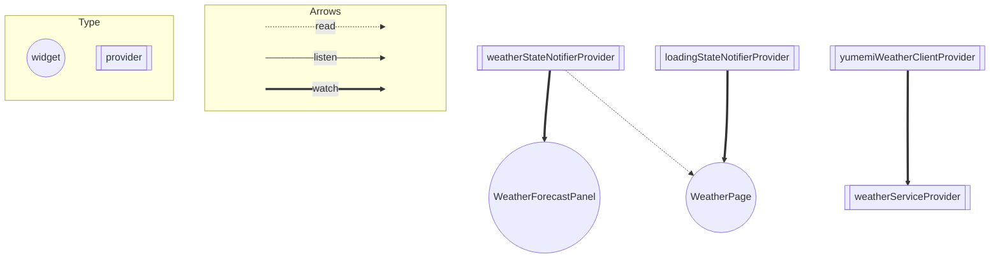

## アーキテクチャ

今回のプロジェクトではあえて、いわゆるアーキテクチャというような大掛かりな設計はせずに、[`WeatherStateNotifier`](../lib/state/weather_state_notifier.dart)
という、天気の取得操作、結果を管理するプロバイダーを作成し、Viewレイヤとやりとりするだけのシンプルな設計にしました。

### ルール

* Stateレイヤでなんらかの状態を操作して保管する。
* Viewレイヤから`ref.read`してStateの操作、`ref.watch`してStateの表示を行う。
* Stateレイヤのロジックが肥大する場合はServiceレイヤに移動させる。

上記のルールに基づいて開発を進めました。

### モチベーション

* 今回のような規模が小さいプロジェクトに、たくさんレイヤーがあるアーキテクチャを採用すると無駄なレイヤーが増え、複雑化する。
* 無理やり一定のアーキテクチャの型にはめると、個人的にはまだアーキテクチャの知識が浅いので、実際の必要性を感じることなく形だけのアーキテクチャになる可能性がある。
* 簡潔でシンプルでわかりやすい。（主観になりますが。。）

## Model

* 天気情報やリクエストを送るモデルを定義、変換処理等を定義

### WeatherCondition

* 天気のステータスを定義、取得した天気に応じてイメージを返すextensionを定義

### WeatherForecast

* 天気の情報、最低気温、最高気温、日にちを定義
* データの変換処理を定義

### WeatherRequest

* リクエストを送るクラスを定義

## Service

* 天気を取得して、[Result](../lib/utils/api/result.dart)型に変換するメソッドを提供する

## State

* `Service`からResultを取得し、取得した天気のデータを保持する

### WeatherStateNotifier

* 天気の取得が成功したらそのデータを格納し、失敗した場合は、`onError`関数を引数で受け取る。

## View

* 天気の表示、エラーのダイアログを表示。 天気を取得するボタンを提供。

### WeatherPage

* アプリのメイン画面
* `Reload`ボタンを押して、`weatherStateNotifierProvider`をreadして、天気の取得処理を行う。
* `weatherStateNotifierProvider`で天気取得に失敗した場合は、エラーメッセージを表示する。

### WeatherForecastPanel

* 天気の情報、気温等を表示しているコンポネント。
* `weatherStateNotifierProvider`をwatchして、天気の状態を表示する。

## Providerの依存関係
