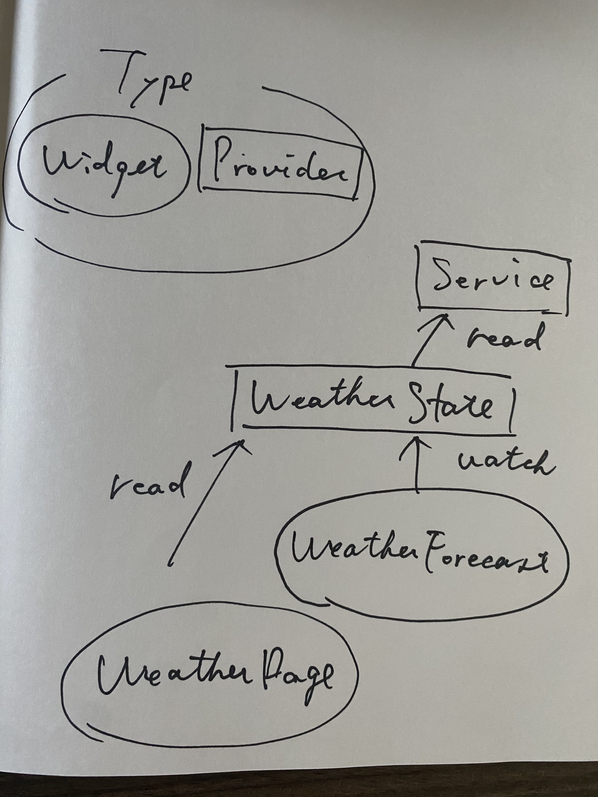

## アーキテクチャ

今回のプロジェクトではあえて、いわゆるアーキテクチャというような大掛かりな設計はせずに、[`WeatherState`](../lib/state/weather_state.dart)
という、天気の取得操作、結果を管理するプロバイダーを作成し、Viewレイヤとやりとりするだけのシンプルな設計にしました。

### ルール

* Sateレイヤでなんらかの状態を操作して保管する。
* Viewレイヤから`ref.read`してStateの操作、`ref.watch`してStateの表示を行う。
* Stateレイヤのロジックが肥大する場合はServiceレイヤに移動させる。

上記のルールに基づいて開発を進めました。

### モチベーション

* 今回のような規模が小さいプロジェクトに、たくさんレイヤーがあるアーキテクチャを採用すると無駄なレイヤーが増え、複雑化する。
* 無理やり一定のアーキテクチャの型にはめると、個人的にはまだアーキテクチャの知識が浅いので、実際の必要性を感じることなく形だけのアーキテクチャになる可能性がある。
* 簡潔でシンプルでわかりやすい。（主観になりますが。。）

## View

---

### WeatherPage

* アプリのメイン画面
* `Reload`ボタンを押して、`weatherStateProvider`をreadして、天気の取得処理を行う。
* `weatherStateProvider`で天気取得に失敗した場合は、エラーメッセージを表示する。

### WeatherForecast

* 天気の情報、気温等を表示しているコンポネント。
* `weatherStateProvider`をwatchして、天気の状態を表示する。

## State

 ---

### WeatherState

* 天気データの取得、管理するプロバイダー
* 天気の取得が成功したらそのデータを格納し、失敗した場合は、`onError`関数を引数で受け取る。

## Service

---

* `WeatherState`での処理が肥大化したので天気を取得する処理はここに移動した。

## Model

---

* 天気情報やリクエストを送るモデルを定義
